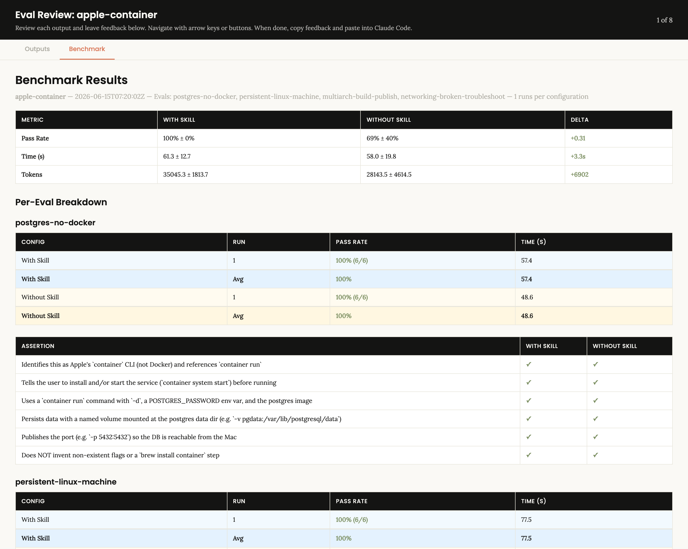
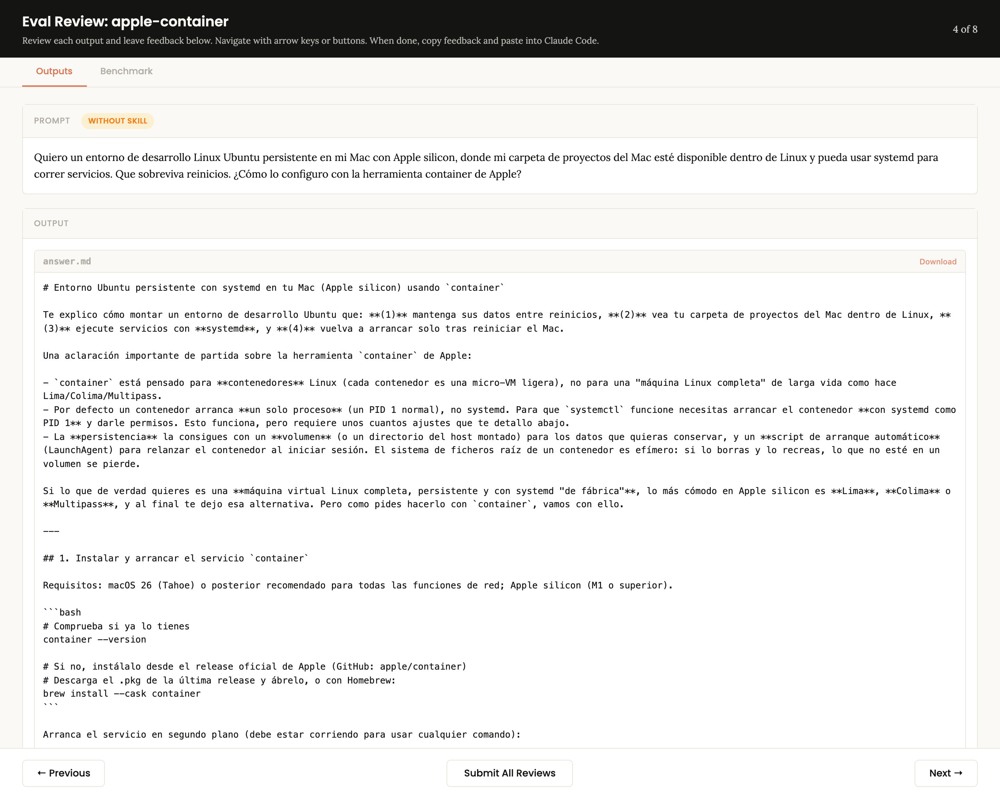
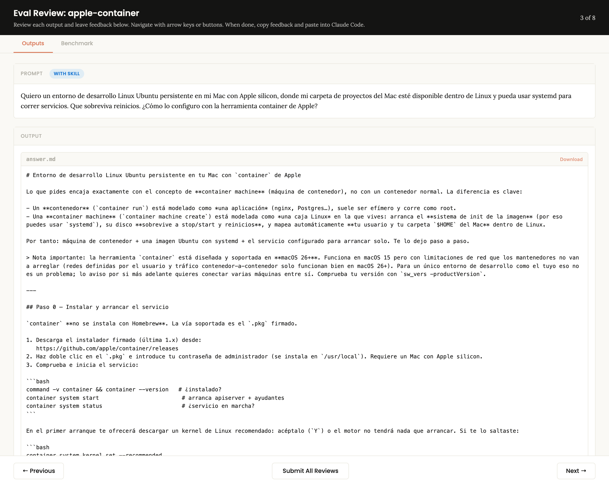

# apple-container-skill

> A [Claude](https://claude.com/claude-code) **skill** that turns the model into a hands-on expert for Apple's [`container`](https://github.com/apple/container) CLI — the open-source tool that runs Linux containers and persistent Linux **"container machines"** as lightweight VMs on Apple-silicon Macs.

Apple's `container` is new enough that a general-purpose assistant gets it *confidently wrong*: it invents a `brew install --cask container`, reaches for Docker Desktop / Lima / Colima, and misses the Mac-specific gotchas that actually bite (per-container IPs, the macOS 15 vs 26 networking gate, `container machine` not even existing in its training data).

This skill fixes that. It's distilled from the entire official documentation set (release `1.x`) into a `SKILL.md` plus four focused references, and — importantly — it's **measured**, not vibes. 👇

---

## 📊 Does it actually help? (measured)

The skill was benchmarked on 4 realistic tasks, each answered **with the skill** and **without it** (plain Claude), then graded against objective assertions.

| Metric | With skill | Without skill |
| --- | --- | --- |
| **Assertions passed** | **22 / 22 (100%)** | 15 / 22 (68%) |



The interesting part is *where* the skill earns its keep. On tasks that mirror Docker (`run` a Postgres, multi-arch `build`) both scored 100% — base Claude already knows those, because `container run`/`build` copy Docker's flags. The gap opens on the genuinely **Mac-specific** tasks:

### Before / after — "I want a persistent Linux dev environment on my Mac"

**❌ Without the skill**, Claude doesn't know `container machine` exists, so it pivots to **Lima / Colima / Multipass** and invents a `brew install --cask container` (1 / 6 assertions passed):



**✅ With the skill**, it correctly identifies this as a **container machine** — explaining that it boots the image's init system (so `systemd` works), persists across restarts, and auto-mounts your Mac `$HOME` and user (6 / 6):



It does the same on a broken-networking troubleshooting prompt: base Claude prescribes a bridge-network fix that **silently fails on macOS 15**, while the skill flags the macOS 15-vs-26 container-to-container limitation up front.

---

## 🚀 Install

This is a Claude Code / Claude skill. Drop it into your skills directory:

```bash
git clone https://github.com/jcordon5/apple-container-skill.git \
  ~/.claude/skills/apple-container
```

That's it — Claude auto-discovers it. Next time you ask about running containers or a Linux environment on your Mac, the skill kicks in. (To verify, ask Claude something like *"how do I run Postgres on my M3 Mac without Docker Desktop?"*)

> Requires the actual tool to *do* anything: a Mac with Apple silicon and Apple `container` (signed `.pkg` from the [releases page](https://github.com/apple/container/releases)). **macOS 26+ is recommended** — `container` runs on macOS 15 but with real networking limitations the skill will warn you about.

## 🧠 What it covers

- **The mental model** that explains every difference from Docker: each container is its *own* micro-VM, with its own IP — not packed into one shared VM.
- **container vs. container machine** — a decision table so you pick the right tool (an app to run, vs. a Linux box to live in).
- **Core workflows**: `run`, `build` (incl. multi-arch via Rosetta), `exec`, `logs`, `stats`, lifecycle.
- **Container machines**: persistent dev environments, home-mount modes, bring-your-own systemd image, the VS Code remote workflow.
- **Networking & storage**: publishing ports (v4/v6), user-defined networks (macOS 26+), local DNS, named/anonymous volumes (and the anonymous-volume cleanup trap), bind mounts, SSH-agent forwarding.
- **Config & troubleshooting**: `config.toml` schema, Rosetta toggle, the memory-ballooning caveat, and a symptom → fix table including the macOS-15 networking failures.

## 📁 What's in here

```
SKILL.md                              # the skill: mental model, macOS gate, install, workflows
references/
├── command-reference.md              # the full CLI surface, every flag
├── container-machines.md             # persistent Linux dev environments + VS Code
├── networking-storage.md             # ports, networks, DNS, volumes, bind mounts
└── config-and-troubleshooting.md     # config.toml + symptom→fix table
evals/evals.json                      # the 4 benchmark tasks used above
assets/                               # benchmark + before/after screenshots
```

## 🔬 How it was built

Researched from the official `apple/container` docs, then iterated with the
[`skill-creator`](https://github.com/anthropics/skills) workflow: write the skill → run each
test task with and without it via independent subagents → grade against objective assertions →
review the outputs in a local viewer (the source of the screenshots above) → improve. The
benchmark numbers and screenshots in this README come straight from that loop.

## 📄 License & disclaimer

[MIT](LICENSE). This is an unofficial, community skill — not affiliated with or endorsed by
Apple. `container` and the Containerization project are Apple's. No warranty; you are
responsible for what you run on your machine.
